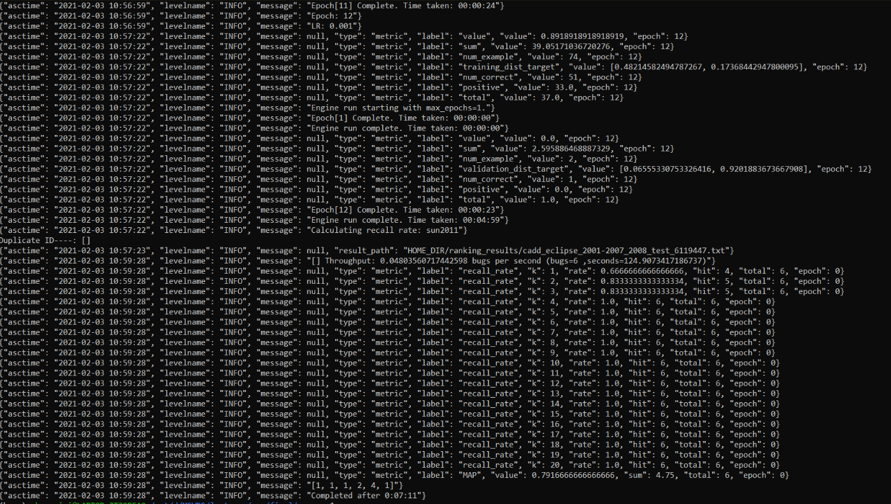
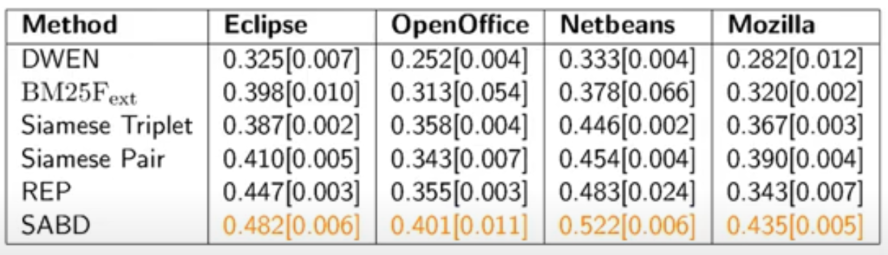

# MSR-Assignment-3
# Soft Alignment Model for Bug Duplication

This is a further research project on paper - "A Soft Alignment Model for Bug Deduplication". The paper aims at the state-of-art development of a novel soft alignment method which helps to identify the distinct bug reports for the same bug registered by multiple users. A novel deep learning model named SABD is implemented to achieve this. Further, the results are evaluated based on the rank-based metric.

# Baseline

##  Metadata 

A reproduction as part of the MSR course at MSR couse 2020/21 at UniKo, CS department, SoftLang Team.

**Paper Title**: "A Soft Alignment Model for Bug Deduplication" by the authors Irving Muller Rodrigues, Daniel Aloise, Eraldo Rezende Fernandes and Michel Dagenais.

**DBLP Link:** https://dblp.org/rec/conf/msr/RodriguesAFD20.html?view=bibtex (https://2020.msrconf.org/details/msr-2020-papers/31/A-Soft-Alignment-Model-for-Bug-Deduplication)

The [Code](https://github.com/irving-muller/soft_alignment_model_bug_deduplication) & [Dataset](https://zenodo.org/record/3922012#.YBUloehKhnI) of the paper can be found here.

## Requirements 

- Hardware
    - Minimum Requirements:  
        - **OS**: Windows / Linux
        - **Processor**: Intel Core i5-3570K 3.4GHz
        - **Memory**: 4 GB RAM
        - **Storage**: 70 GB Hard drive space

    - **Recommended Requirements**:  
        - **OS**: Windows / Linux
        - **Processor**:  Intel Core i7-4790 4-Core 3.6GHz
        - **Memory**: 8/16 GB RAM
        - **Storage**: 70 GB **SSD** space
        - **GPU** : NVIDIA GPUs G8x version onwards

- Software
    - Python, Pytorch, nltk, scipy, ujson, pytorch ignite 0.1.2, sacred, MongoDB


## Process

### Step 1: Package Installation
Install the following packages:

```bash
#CPU
conda install pytorch torchvision cpuonly -c pytorch 
#GPU
conda install pytorch torchvision cudatoolkit=10.1 -c pytorch

conda install -c anaconda nltk
conda install -c anaconda scipy
conda install -c anaconda ujson
conda install -c pytorch ignite=0.4.2
pip install sacred 
conda install ignite -c pytorch
```
Otherwise, run the below command to install all the Packages.
```bash
pip install -r requirements.txt
```

### Step 2: Data Extraction
The complete data can be found [here](https://zenodo.org/record/3922012#.YBUloehKhnI) .

The data can also be fetched by the below process:

The data used in the paper can be found [here](https://zenodo.org/record/3922012). One folder contain the word embeddings and four remaining ones 
contain the dataset of the open-sources projects (Eclipse, Netbeans, Open Office and Firefox).
This data came from the [Lazar's work](https://dl.acm.org/doi/abs/10.1145/2597073.2597128  ).
The original dataset is available [here](http://alazar.people.ysu.edu/msr14data/ ).

During data extraction mongodb is required to get the data from Lazar's work(this work uses mongo data base to store and extract the data). We use the obtained data and process it.

```bash
 wget http://alazar.people.ysu.edu/msr14data/datasets/eclipse.tar.gz
 tar zxvf eclipse.tar.gz
 mongorestore
 mongo eclipse
 show collections
 db.initial.count()
 
 wget http://alazar.people.ysu.edu/msr14data/datasets/mozilla.tar.gz
 tar zxvf mozilla.tar.gz
 mongorestore
 mongo mozilla
 show collections
 
 
 wget http://alazar.people.ysu.edu/msr14data/datasets/openOffice.tar.gz
 tar zxvf openOffice.tar.gz
 mongorestore
 mongo openOffice
 show collections
 
 wget http://alazar.people.ysu.edu/msr14data/datasets/netBeans.tar.gz
 tar zxvf netBeans.tar.gz
 mongorestore
 mongo netBeans
 show collections
``` 

*The commands below generates the dataset of each open-sources projects:*
> Note: Lazar's dataset has to be dumped into mongo before running these commands


### Step 3: Data Preprocessing

> Note: The code has been completely automated for **Ecliple**. After running the command under eclipse, we can directly run the SABD code under **Usage**.

```bash    
# Eclipse
python3 data/create_dataset_our_methodology.py --database eclipse --collection initial --bug_data DATASET_DIR/eclipse_2001-2007_2008/eclipse_initial.json --training  DATASET_DIR/eclipse_2001-2007_2008/training_split_eclipse.txt --validation  DATASET_DIR/eclipse_2001-2007_2008/validation_eclipse.txt --test DATASET_DIR/eclipse_2001-2007_2008/test_eclipse.txt --date="2008/01/01" --date_threshold="2008/12/31" --no_tree --dev_perc=0.05

python3 data/clean_data.py --bug_dataset DATASET_DIR/eclipse_2001-2007_2008/eclipse_initial.json --output DATASET_DIR/eclipse_2001-2007_2008/eclipse_soft_clean_rm_punc_sent_tok.txt.json --fields short_desc description --type soft --rm_punc --sent_tok --lower_case

# example to generate pairs and triplets
python data/generate_pairs_triplets.py --bug_data DATASET_DIR/eclipse_2001-2007_2008/eclipse_initial.json --dataset DATASET_DIR/eclipse_2001-2007_2008/validation_eclipse.txt --n 1 --type random

python data/generate_pairs_triplets.py --bug_data DATASET_DIR/eclipse_2001-2007_2008/eclipse_initial.json --dataset DATASET_DIR/eclipse_2001-2007_2008/test_eclipse.txt --n 1 --type random

python data/generate_pairs_triplets.py --bug_data DATASET_DIR/eclipse_2001-2007_2008/eclipse_initial.json --dataset DATASET_DIR/eclipse_2001-2007_2008/training_split_eclipse.txt --n 1 --type random

# example to create categorical_lexicons
python data/generate_categorical_lexicon.py --bug_data DATASET_DIR/eclipse_2001-2007_2008/eclipse_initial.json -o DATASET_DIR/dataset/sun_2011/eclipse_2001-2007_2008/categorical_lexicons.json


# Mozilla
python3 data/create_dataset_our_methodology.py --database mozilla --collection initial --bug_data DATASET_DIR/mozilla_2001-2009_2010/mozilla_initial.json --training DATASET_DIR/mozilla_2001-2009_2010/training_split_mozilla.txt --validation  DATASET_DIR/mozilla_2001-2009_2010/validation_mozilla.txt --test DATASET_DIR/mozilla_2001-2009_2010/test_mozilla.txt --date="2008/01/01" --date_threshold="2008/12/31" --no_tree --dev_perc=0.05

python3 data/clean_data.py --bug_dataset DATASET_DIR/mozilla_2001-2009_2010/mozilla_initial.json --output DATASET_DIR/mozilla_2001-2009_2010/mozilla_soft_clean_rm_punc_sent_tok.txt.json --fields short_desc description --type soft --rm_punc --sent_tok --lower_case

# Netbeans
python3 data/create_dataset_our_methodology.py --database netBeans --collection netall --bug_data DATASET_DIR/netbeans_2001-2007_2008/netbeans_initial.json --training  DATASET_DIR/netbeans_2001-2007_2008/training_split_netbeans.txt --validation  DATASET_DIR/netbeans_2001-2007_2008/validation_netbeans.txt --test DATASET_DIR/netbeans_2001-2007_2008/test_netbeans.txt --date="2008/01/01" --date_threshold="2008/12/31" --no_tree --dev_perc=0.05

python3 data/clean_data.py --bug_dataset DATASET_DIR/netbeans_2001-2007_2008/netbeans_initial.json --output DATASET_DIR/netbeans_2001-2007_2008/netbeans_soft_clean_rm_punc_sent_tok.txt.json --fields short_desc description --type soft --rm_punc --sent_tok --lower_case


# OpenOffice
python3 data/create_dataset_our_methodology.py --database openOffice --collection ooall --bug_data DATASET_DIR/open_office_2001-2008_2010/open_office_initial.json --training  DATASET_DIR/open_office_2001-2008_2010/training_split_open_office.txt --validation  DATASET_DIR/open_office_2001-2008_2010/validation_open_office.txt --test DATASET_DIR/open_office_2001-2008_2010/test_open_office.txt --date="2008/01/01" --date_threshold="2010/12/31" --no_tree --dev_perc=0.05

python3 data/clean_data.py --bug_dataset DATASET_DIR/open_office_2001-2008_2010/open_office_initial.json --output DATASET_DIR/open_office_2001-2008_2010/open_office_soft_clean_rm_punc_sent_tok.txt.json --fields short_desc description --type soft --rm_punc --sent_tok --lower_case
```
   
## Usage

In order to train SABD, a json have to be created with the argument values of SABD. 

Run python script datas/sabd.py to perform the experiments.
> Note: The embedding data thats is available [here](https://zenodo.org/record/3922012) should be pasted in HOME_DIR folder.

```bash
# Examples
python3 data/sabd.py -F HOME_DIR/experiments with HOME_DIR/duplicate-bug-report/json_parameters/sabd_eclipse_test.json "recall_rate.window=365"
python3 data/sabd.py -F HOME_DIR/experiments with HOME_DIR/duplicate-bug-report/json_parameters/sabd_open_office_test.json "recall_rate.window=365"
python3 data/sabd.py -F HOME_DIR/experiments with HOME_DIR/duplicate-bug-report/json_parameters/sabd_netbeans_test.json "recall_rate.window=365"
python3 data/sabd.py -F HOME_DIR/experiments with HOME_DIR/duplicate-bug-report/json_parameters/sabd_mozilla_test.json "recall_rate.window=365"
```
## Data

### Input Data
- The Bug report is collected from four open source projects (Eclipse, Mozilla, NetBeans and Open Office). 
- Soft Alignment Model for Bug Deduplication (SABD) model receives the bug reports as the input which is composed of the categorical fields, a summary and a description. 
- We get the input data from the data extraction phrase. The sample data is present [here](https://github.com/AbinayaThulsi/MSR-Soft-Alignment-Model-for-Bug-Duplication/tree/main/data/HOME_DIR/dataset/sun_2011/eclipse_2001-2007_2008).

### Output Data
- Soft Alignment Model for Bug Deduplication (SABD) model outputs the probability of the bug report being a duplicate and indicates whether the given reports are duplicate. 
- The output is evaluated using two metrics i.e. mean average precision (MAP, a ranking based metric) and recall rate@k (RR@k). This is been calculated for each open source at k= 1 to 20, where k is the list of bug reports recommended by the triager. Therefore, with the help of Time Window for a period of 1 to 3 years the data is being compared.
- The output of our sample data can be found [here](https://github.com/AbinayaThulsi/MSR-Soft-Alignment-Model-for-Bug-Duplication/tree/main/process/Ouput_Sample_data). Output_365Days.png is the output we get in th console and few are jsons created during code run. Andcout.txt is the text format of the output obtained in the console

## Results

The attached screenshot is the final results which we have achieved.
Since we had to use a small data of about 600 records the recall rate becomes 1 from k=3 onwards. So, we ran only for the Eclipse as it would be the same case for other open sources because of data constraint.



## Delta

### Process Delta 
- We were able to fetch the data using the commands provided with few minor changes in the code (e.g.Changing the path). The data was fetched to mongodb and then to local system.
- Data preprocessing also worked fine (cleaning data, creating pairs etc). 
- The method was tested with a time window of one year and three years to measure how its size affects performance.
- During analysis sabd.py program had to be modified to run for the CPU instead of GPU. As we did not have the version of GPU needed to run the code for the dataset provided.

### Data Delta
- When we ran the code with CPU instead of GPU, the code ran for about 20 hours without any outputs as the size of dataset was huge. So we manually took the sample of data for one of the open source (eclipse) and preprocessed data using clean_data, generate_pairs_triplets, generate_categorical_lexicon. 
- We ran the sabd.py code for 1 year and 3 years window and we got the final output. i.e, ranking rate for k 1 to 20 and the value of MAP.
- Since we could only run for sample data we could not compare the results with other open sources or with other methodologies. 
- The code article_results.ipynb gives the comparison for all open sources and other methodologies. These ranking rates were fetched by the author of the paper. All the ranking rates were fetched as a list in article_results.ipynb code. As mentioned in 3rd point we were not able to compare because of the GPU constraint.

### Problems Faced
- During data fetch phrase we did not face much issues, MongoDB was required and a few minor changes had to be done. Data preprocessing went smoothly.
- The major issue was while running sabd.py which took us a few days to figure out the exact issue which was related to compatibility and version. We were getting GPU issue (Error: No HIP GPU available) which we resolved by downloading drivers. But, the versions were not matching so NVIDIA failed to communicate with the driver (Error : No Nvidia driver in your system).
- To overcome GPU issue, we tried to run the code with only CPU. But the code was running for epoch:1 for about 20 hours. 
- We tried running for 10000 records but after 1 hour the code was still at epoch 1.
- So we decided to run the code by taking around 500-600 records and were able to receive recall-rate within 10 mins. The sample data we have provided for eclipse has around 600 records. 

# Experiment

## Threat

The model is slower than the methods based on Siamese neural networks. Hence the runtime itself is high with GPU. In our case, as mentioned by us in assignment 2 we ran using CPU so the time taken will be even more. Hence, we decided to work on reducing the runtime using other algorithms.

## Theory

If this has to be used in real-time and GPU is not available then it will be difficult to find the bugs as the time taken will be more. We are planning to address this issue by using different algorithm in Siamese network which is YOCO(You Only Compare Once). YOCO compares many records in one forward propogation. Using this we can reduce the run time. We have got some idea about few alternate algorithms that can be used. We will try to overcome this issue by trying the different algorithms.

## Research

As mentioned during the agreement the only threat that we came accross was runtime issue. Since the fixed-length representations of the reports is being generated jointly, it seemed to be hard to save computation time. Hence, the SABD model is slower based on Siamese neural networks. In-Order to reduce the runtime, we looked for many alternative sources. 
### First Approach :
One such alternative which we came across was implementing an algorithm called [YOLO](https://medium.com/@kuzuryu71/improving-siamese-network-performance-f7c2371bdc1e). The idea behind the choice of YOLO was, it compares many bugs in one forward propagation steps. This helps in reducing the execution time faster. 
We started looking into YOCO (You Only Compare Once) and YOLO(You Only Look Once). These are the techniques used to improve the performance in siamese network. YOLO is the algorithm which detects or finds duplicates in one forward propogation instead of going in loop and YOCO compares in one forward propogation. We went through many papers and GitHub repositories to address our threat in the similar way.  Since there were not many resources available, we ourself tried to implement the idea of algorithm. But, we were not able to fix the issue.

### Second Approach:
Secondly, we decided to proceed with of changing Siamese algorithm, using YOCO and YOLO in this algorithm. We started working on siamese_pairs code and we made some code changes. Please refer [assignment 2](https://github.com/AbinayaThulsi/MSR-Soft-Alignment-Model-for-Bug-Duplication) for the data extraction part.

##### Command to Execute :
```bash
python3 experiments/siamese_pairs.py  -F HOME_DIR/experiments with HOME_DIR/duplicate-bug-report/json_parameters/siamese_pair_test_eclipse.json "recall_rate.window=365"
```
But it was able to run only until the 1st epoch, afterwards we started getting segmentation error. Later, We thought of implementing YOCO and YOLO concept in siamese pair code but we couldnt find more resource for YOCO and YOLO and how it can be used in textual module , The resource we found was for image module and we could have used the concept and implemented in siamese code we have updated but as we started searching deeply about both the algorithms we understood that sabd is already better than [Siamese](https://ieeexplore.ieee.org/document/1467314)(SABD might be slower than siamese but when real time is considered sabd outperforms siamese pair and siamese triplet). So if we succeed in saving runtime then performance in terms of recall rate would still be less and we did not want to spend much time in fixing the code. Instead of investing more time on this we started looking into other techniques.

### Third Approach:
As the [attention mechanism](https://arxiv.org/abs/1409.0473) computes interdependent representations for each report jointly for pair of possibly duplicate reports, it is the main reason for the model being slow and not being efficiently faster. So, we even tried to split and generate the representation in batches. But the bug duplicate report detection accuracy was not remarkable. As already stated in the paper, even though fixed representation consumes more time the model performs the best only by that. 

## Conclusion
Along with above mentioned three approaches, we further investigated several related works and papers. We also understood that SABD is using best and realistic methodology compared to other models addressed in other similar papers, which was mentioned in our paper as well. Nevertheless, we still wanted to try out few other alternatives and come to conclusion and concluded that, the mentioned three approaches seemed more suitable for addressing the Bug tracking System’s (BTS) threat. It cannot be said that reducing the execution time is impossible because the Siamese approach seems to be quiet convincing.  But, with the time constraints and few available resources it was hard to try other approaches completely. While trying out the methodologies, we were facing challenges in either resolving the issues or method was more time consuming compared to SABD approach.

Here are few links that are stated in paper. Ongoing through these reference, it is explainable why our paper is already considered as best compared to other existing models. 
1.	[Siamese](https://ieeexplore.ieee.org/document/8094414) As mentioned above all Siamese related papers can be considered to overcome few issues but the existing one's will give lower RR@K compared to SABD.
2.	Few techniques used by [Poddar et al](https://www.aclweb.org/anthology/N19-2020/) in this paper is taken to implement SABD.
3.	[Sun et al](https://ieeexplore.ieee.org/document/6100061) mean average precision (MAP) and recall rate@k (RR@k) techniques used in this paper is taken to implement SABD.



The below are the references we came across during our research. These papers were facing similar threats as ours which makes use of other techniques. 

1.	[Automated Duplicate Detection for Bug Tracking Systems](https://web.eecs.umich.edu/~weimerw/p/weimer-dsn2008.pdf) is a very old paper which uses linear regression, but many new techniques are come into light now a days for the amount of data we are getting in real world.
2.	[Budhiraja](https://dl.acm.org/doi/proceedings/10.1145/3183440)'s technique is already referred by our author. So, we either found very old techniques or the ones used in our paper as reference to make our paper the best.

Even though the previous works similar to SABD they were are not much helpful, this research helped to realise that SABD model of Bug tracking system is the combination of all best techniques which were addressed separately in previous works. Hence, having execution time constraint to be the only threat we could not find much resource which can be used to make our code even better. We tried all the possible techniques we can come up with.

